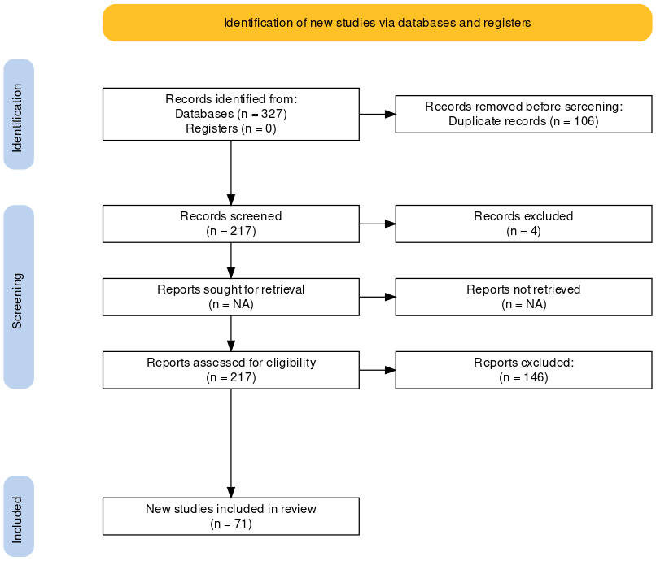

```{r setup, include=FALSE}
knitr::opts_chunk$set(echo = FALSE, message = FALSE, warning = FALSE)

library(tidyverse)
library(kableExtra)
```


# Methodology

This study is performed using a systematic review method in which an attempt is made to collect empirical evidence explicitly and systematically using pre-specified eligibility criteria to answer a specific research question [@cochrane]. Further, according to @brown_uni, the key criteria of the systematic literature review are: *"a clearly defined question with inclusion & exclusion criteria; rigorous & systematic search of the literature; critical appraisal of included studies; data extraction and management; analysis & interpretation of results; and report for publication."* Hence, to conform with these criteria, this study incorporates the Preferred Reporting Items for Systematic Reviews and Meta-Analysis (PRISMA)’s checklist and flow diagram. The following subsections discuss the steps conducted following those criteria. 


## Literature Identification

MRP is applied in various scientific fields, ranging from social and political science to public health. Therefore, to identify the literature, this study refers to research databases instead of field-specific journals. Those databases are JSTOR, EBSCO, and PubMed. The first two databases are chosen due to their broad range of field coverage, while the latter is chosen since MRP is sometimes also applied in the health and medical field. Choosing these databases also considers that heterogeneity of included studies is one of the important factors in a systematic literature review [@SchweizerMarinL2017Apgt].

Further, we identify the literature using the combination of several search terms. Mostly the search term includes the term "multilevel regression, "post-stratification", "poststratification", and "multilevel model". Our target literature is articles that are written in English. Regarding the time of publication, we exclude all of the publications before 1997 since the MRP method has not been developed in this period. We have also done two steps in identifying the literature. At first, we only include the abstract in searching the article. However, it will restrict us to only get the article which has the search term in the abstract/title only. Hence, in the second identification, we include "all field" in searching the articles. Note that for EBSCO, we directly apply the search for all fields. The detailed literature identification is shown in Table \@ref(tab:search-term). 

In total, we get 327 articles. Next, we utilize literature managers, EndNote X9, to manage these articles and to find duplicate articles. After removing those duplicate articles, we get 221 articles to be screened in the next stage. 

## Screening and Eligibility Criteria

We screen all of the articles whether they fit the criteria to be included in the study or not. During the screening process, we find that 4 articles are apparently not research papers. Hence, we exclude them from the list. To be included in this study, we set eligibility criteria as follows:

1. It should apply MRP as its method.
2. It should contain at least one plot relate to MRP findings. 

In this stage, we excluded 146 articles. Most of these articles are excluded because they do not meet Criteria 1, which is not using MRP as its method. These articles are captured in the first stage mainly because they contain the search term (i.e., "multilevel regression" or "post-stratification") in them. Many of them only use a common stratification weighting. Also, some articles using another method, but they mention MRP in their literature review as an alternative method to do the analysis. Other articles are excluded because they do not meet Criteria 2, which is does not convey their MRP result in a single plot.

Finally, we have 71 articles to be reviewed in the next stage. Figure \@ref(fig:prisma-flowchart) displays the PRISMA flow chart of this study. 

```{r prisma-flowchart, fig.cap= "PRISMA folow chart of this systematic literature review.", out.width="90%"}


```


## Data Extraction and Analysis

We focus the data extraction to the MRP-related plot. We create a metadata for each plot (included in supplementary material of this study). To build a metadata we classify the plot into two types, i.e., communication (coded to 0) and diagnostic plot (coded to 1). For diagnostic plots, we examine whether the plots compare MRP with other estimates, which are:

1. raw (direct estimates or direct disaggregation);
2. truth;
3. weight estimation;
4. estimates of other MRP models, for example, the paper build several MRP models from various simulation scenarios or using different covariates;
5. estimates from another study/survey;
6. estimates from another method, for example comparing MRP with Bayesian Additive Tress with Post-Stratification. 

Plot that show a comparison of MRP with each of the above list would be coded to 1, otherwise coded to 0.
The diagnostic plot could also display the performance of MRP using several performance criteria, as follows:

1. bias;
2. Mean Absolute Error (MAE);
3. Mean Square Error (MSE)/ Relative Mean Square Error (RMSE);
4. Standard Error (SE);
5. correlation. 

Just like the comparison, the MRP-related plot would be reviewed whether it is contains each of those performance criteria (coded 1) or not (coded 0). 

We also review other features of the plot using the grammar in **`ggplot2`** [@ggplot2]. We examine the facet, plot type, what is put in the x, y-axis, color, and shape. Besides, the metadata also contains the paper's author/s, paper's year, paper's title, and plot's figure number. 

After the extraction, we analyze the data using graphical visualization with **`ggplot2`**. The result will be discussed in the next section. 


```{r search-term}

search <- tribble(~Database, ~`Search Terms`, ~`Search Field`, ~Inclusion, ~Exclusion, ~`Number Returned`,
                  'JSTOR', '(multilevel regression and poststratification) OR (“post-stratification”)', 'Abstract', 'Article, content I can access, English', 'anything before 1997', 44,
                  'JSTOR', '(("multilevel regression" AND ("post-stratification" OR Poststratification)) OR ("multilevel model" AND ("post-stratification" OR Poststratification)))', 'All field', 'Article, English', 'anything before 1997', 142, 
                  'EBSCO', '"multilevel regression with post-stratification" OR "multilevel regression with poststratification" OR "multilevel regression and Poststratification" OR "multilevel regression and Post-stratification"', 'All field', 'Academic (Peer-Reviewed) Journals, English', 'anything before 1997', 42,
                  'EBSCO', '(multilevel regression AND post-stratification) OR (multilevel model AND post-stratification) OR (multilevel regression AND poststratification ) OR (multilevel model AND poststratification)', 'All field', 'Academic (Peer-Reviewed) Journals, English', 'anything before 1997', 45,
                  'PubMed', '"multilevel regression with post-stratification" OR "multilevel regression with poststratification" OR "multilevel regression and Poststratification" OR "multilevel regression and Post-stratification"', 'Title/Abstract', 'Article, English', 'anything before 1997', 26,
                  'PubMed', '(multilevel regression AND post-stratification) OR (multilevel model AND post-stratification) OR (multilevel regression AND poststratification) OR (multilevel model AND poststratification)', 'All field', 'Article, English', 'anything before 1997', 28,)


search %>% kable(format = "latex", booktabs = TRUE, caption = "Detail of literature identification") %>% kable_styling(latex_option = "scale_down") %>% landscape()
```


# References

