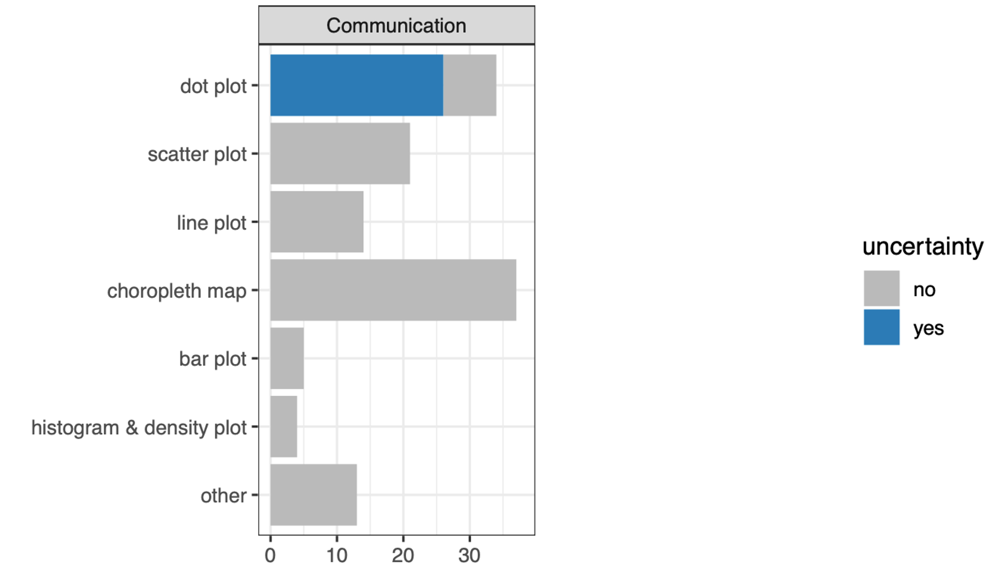
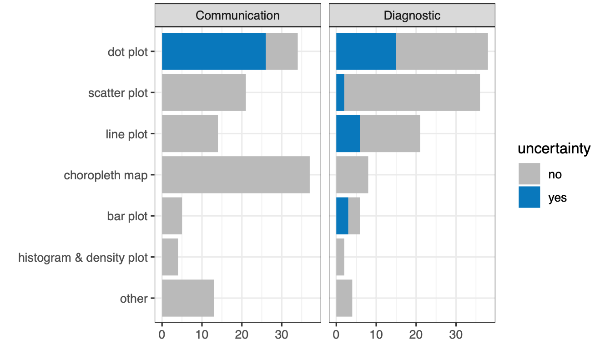
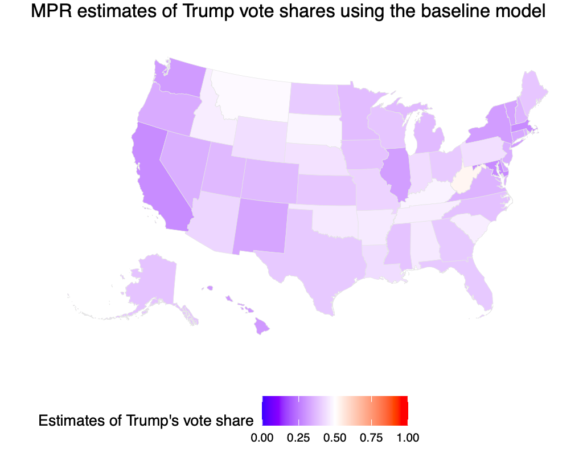

```{r xaringan-themer, include=FALSE, warning=FALSE}
library(xaringanthemer)
style_duo_accent(
  primary_color = "#2E86C1",
  secondary_color = "#C12E82",
  inverse_header_color = "#FFFFFF"
)
```

class: center, middle

background-image:url(image/cover.png)
background-size: cover

```{r setup, include=FALSE}
options(htmltools.dir.version = FALSE)
```

---
<br>

# Background and Motivation


- Surveys are important.

- Multilevel regression and poststratification could provide reliable estimates of subpopulations.

- Graphical display is widely used to communicate and diagnose MRP estimates. 

- Makela, Si, and Gelman (2017) and Schneider and Jacoby (2017) study the visualisation of polling data and public opinion research. 


---

# Study Objectives 


Perform **Systematic Literature Review** to:

- Understand the current practice of visualisation of MRP models.

and **Case Study** to:

- Understand the implication of existing visualisation choices with real-world data. 

- Explore possible improvement of the current practice of MRP visualisation. 


---
# Systematic Literature Review

.pull-left[

- Identification of relevant literature, i.e., articles using MRP as its method and should display at least one MRP visualtisation. 

- Database used to identify literatures: JSTOR, EBSCO, and PubMed. 

- Done in two stages: abstract and full manuscript review.

- 71 articles are relevant; extracted 243 plots. 

]

.pull-right[


]

---

# Systematic Literature Review

.pull-left[

- Identification of relevant literature, i.e., articles using MRP as its method and should display at least one MRP visualtisation. 

- Database used to identify literatures: JSTOR, EBSCO, and PubMed. 

- Done in two stages: abstract and full manuscript review.

- 71 articles are relevant; extracted 243 plots. 

]

.pull-right[

**Common plot type displayed**



]

---
# Systematic Literature Review

.pull-left[

- Identification of relevant literature, i.e., articles using MRP as its method and should display at least one MRP visualtisation. 

- Database used to identify literatures: JSTOR, EBSCO, and PubMed. 

- Done in two stages: abstract and full manuscript review.

- 71 articles are relevant; extracted 243 plots. 

]

.pull-right[

**Common plot type displayed**



]

---
## Case Study

### Aim

Applies MRP in estimating the Trump's vote share in the U.S. 2016 Presidential Election.

### Data 

- Survey data: Cooperative Congressional Election Study (CCES) 2016. 

- Population data: American Community Survey (2015-2017)

---

### Visualising MRP 


- **Communication-purpose visualisation**
- **Metrics visualisation**
- **Comparison-purpose**

  - Comparison of estimation methods (raw, weighted, and MRP estimates)
  - Comparison of model specifications:
    
```{r, echo = FALSE, warning = FALSE, message = FALSE}
library(tidyverse)
library(kableExtra)
tribble(~Model, ~Response, ~Predictors,
        "Baseline", "vote", "age, gender, state, collapsed_race",
        "Model 2", "vote", "age, gender, state, collapsed_race, education",
        "Model 3", "vote", "age, gender, state, original_race",
        "Model 4a", "intent", "age, gender, state, collapsed_race, education",
        "Model 4b", "party id", "age, gender, state, collapsed_race, education") %>%
  kable(caption = "Model specifications in the case study") %>%
  kable_styling()
```

---

### Comparison of Estimation Methods (raw, weighted, and MRP)


.pull-left[

**Current practice**

```{r, echo = FALSE, message = FALSE, out.width = "85%"}
library(here)
library(knitr)

img <- here("presentation/final_presentation/image/scatter1.png") 
include_graphics(img)
```
]


.pull-right[

]

---

### Comparison of Estimation Methods (raw, weighted, and MRP)

.pull-left[

**Current practice**

```{r, echo = FALSE, message = FALSE, out.width = "85%"}
library(here)
library(knitr)

img <- here("presentation/final_presentation/image/scatter1.png") 
include_graphics(img)
```
]


.pull-right[

**Alternative**


```{r, echo = FALSE, out.width = "75%"}
include_graphics(here("presentation/final_presentation/image/dot.png"))
```

]

---

**Comparison of Model Specifications (current practice)**

.center[
```{r, echo = FALSE, message = FALSE, out.width = "75%"}
include_graphics(here("presentation/final_presentation/image/scatter2.png"))
```
]
---

**Comparison of Model Specifications (alternative)**

.center[
```{r, echo = FALSE, out.width = "75%"}
include_graphics(here("presentation/final_presentation/image/violin.png"))
```
]

---

# Conclusion

- This study has shown us the current practice in MRP visualisation. 

- Uncertainty is often not taken into account when visualising MRP, hence we offer some alternatives to display it. 

- **Future work** is needed with careful experimentation to provide the evidence whether these alternatives can communicate MRP models more effectively and enhance interpretability.

---

# References 

Makela, S, Y Si, and A Gelman (2017). “Graphical Visualization of Polling Results”. In:
The Oxford Handbook on Polling and Polling Methods. Ed. by L Atkeson and M Alvarez.
Oxford UK: Oxford University Press.


Schneider, SK and WG Jacoby (2017). “Graphical Displays for Public Opinion Research”. In: The Oxford Handbook on Polling and Polling Methods. Ed. by L Atkeson and M Alvarez.
Oxford UK: Oxford University Press.

---
class: center, middle

# Thanks!

Slides created via the R package [**xaringan**](https://github.com/yihui/xaringan).

---

## Communication-purpose visualisation

.pull-left[

]
.pull-right[

<br>
- Choropleth can hinder the information of small area with small polygon.

- Only displays point estimates.

- Often hard to interpret.
]

---

## Metrics visualisation

.pull-left[

**Common metrics**

```{r, echo = FALSE, message = FALSE, out.width = "70%"}
include_graphics(here("presentation/final_presentation/image/met1.png"))
```
]


.pull-right[

**Additional**

```{r, echo = FALSE, out.width = "90%"}
include_graphics(here("presentation/final_presentation/image/met2.png"))
```

]

