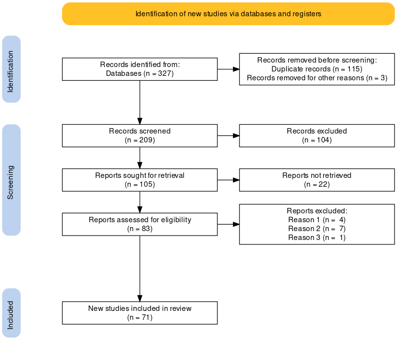

```{r setup-chap2, include=FALSE, cache=FALSE}
library(knitr)
read_chunk(here::here("sis_literature_review/analysis/slr_analysis.R"))
```

```{r pkgs}
```


# Systematic Literature Review {#sec:syslitrev}

This study is performed using a systematic review method. This method collects empirical evidence explicitly and systematically using pre-specified eligibility criteria to answer a specific research question [@cochrane]. Systematic literature reviews also enable the process of finding the gap in a field of science, such as understanding what has been done and what needs to be done [@LinnenlueckeMartinaK2020Cslr]. Hence, in this case, systematic literature review could assist us to understand the common practice in MRP visualisations so that we can explore how to improve. 

According to @brown_uni, the key criteria of the systematic literature review are: *"a clearly defined question with inclusion & exclusion criteria; rigorous & systematic search of the literature; critical appraisal of included studies; data extraction and management; analysis & interpretation of results; and report for publication."* Hence, to conform with these criteria, this study incorporates the Preferred Reporting Items for Systematic Reviews and Meta-Analysis (PRISMA)’s checklist and flow diagram. The following subsections discuss the steps conducted following these criteria. 

## Literature Identification 

MRP is applied in various scientific fields, ranging from social and political science to public health. Therefore, to identify relevant literature, this study refers to research databases instead of field-specific journals. Those databases are JSTOR, EBSCO, and PubMed. The first two databases are chosen due to their broad range of field coverage, while the latter is chosen since MRP is sometimes also applied in the health and medical fields. These databases were also chosen to represent the  heterogeneity of the field, which is one of the important factors in a systematic literature review [@SchweizerMarinL2017Apgt].

From these databases we identify relevant articles using the combination of several search terms. Generally the search terms include the term "multilevel regression", "post-stratification", "poststratification", and "multilevel model". Our target literature is articles that are written in English. We exclude all of the publications before 1997 since this was the first proposal date for MRP. Initially we included only the title/abstract when searching these databases. However, using this method limits the set of potential articles to only include those with the search term in the abstract/title. To rectify this, we also include a search with "all field" in the search criteria. Note that for EBSCO, we directly apply the search for all fields. The detailed literature identification is shown in Table \@ref(tab:search-term). 

The total number of articles from this search criteria are 327. Next, we utilize the literature manager, EndNote X9, to manage these articles and to find duplicate articles. After removing those duplicate articles, we have 212 articles to be screened in the next stage. 

```{r search-term}
```

## Screening and Eligibility Criteria

We screen all of the articles based on predetermined criteria. We find that 3 articles are apparently not research papers. This results in 209 abstracts to be screened. To screen efficiently, we use two stages. The first stage is a review of abstracts, the second a full manuscript review.  

### Stage 1: Review of abstracts

In the first stage DA and LK independently review all article abstracts with the following eligibility criteria:

1. The abstract should mention analysis of data or creation of simulation data. 
2. The abstract should mention the use of MRP or multilevel models to make population estimates or the use of other regression models (BART, spatial, stacking, trees) to make population estimates.

During the screening, DA and LK agreed that 61 articles meet the eligibility criteria listed above, while 104 articles do not meet the criteria. The two reviewers disagreed on 44 articles. Accordingly, DA and LK skim the full manuscript to decide whether the paper could be included in the next stage or not. As the result, an additional 22 more articles are moved to stage 2, making a total of 83. 

### Stage 2: Full manuscript review

DA reviews the full manuscript on 83 articles based on a second set of criteria. The aim of this stage is to get the list of the final articles that would be included in the study. We set the criteria of inclusion as follow:

1. It should apply MRP as its method.
2. It should contain at least one plot relate to MRP findings. 

During this stage, we exclude 4 articles as they do not meet the first criteria. Further, 7 articles are excluded as they do not meet the second criteria. Also, an article is not included because it is a duplicate that was not detected automatically by Endnote X9. Finally, we have 71 articles to be reviewed in the next stage. Figure \@ref(fig:prisma-flowchart) displays the PRISMA flow chart of this study. This figure is generated using `PRISMA2020` [@prisma2020]. 

```{r prisma-flowchart, fig.cap= "PRISMA flow chart of this systematic literature review.", out.width="90%"}

```

## Data Extraction and Analysis

We focus the data extraction on the MRP-related plot. We manually create a metadata for each plot (included in the supplementary material). We will use this metadata to analyse the current reporting practices with MRP. This metadata will also ensure the reproducibility of the analysis and to maintain the transparency of the systematic literature review process. 

We code the plots according to their type, i.e., communication (coded to 0) and diagnostic plot (coded to 1). For diagnostic plots, we examine whether the plots compare MRP with other estimates, which are:

1. Raw (direct estimates or direct disaggregation);
2. Ground truth;
3. Weighted estimates;
4. Estimates from other MRP models, for example, a paper build several MRP models from various simulation scenarios or using different covariates;
5. Estimates from another study/survey;
6. Estimates from another method, for example comparing MRP with Bayesian Additive Tress with Post-Stratification(BARP). 

Plots that show a comparison of MRP with the above list would be coded to 1, otherwise coded to 0.
Diagnostic plots also categorised based on how they compare the performance of MRP. The five observed criteria are:

1. Bias;
2. Mean Absolute Error (MAE);
3. Mean Square Error (MSE)/ Relative Mean Square Error (RMSE);
4. Standard Error (SE);
5. Correlation. 

Each plot is assessed based on the use of the performance metric. For each metric is scored based on whether it is used (coded 1) or not (coded 0). 

We also review other features of the plot using the grammar in `ggplot2` [@ggplot2] as a framework. The common grammar used in practice allows us to understand to what extend MRP models are effectively visualised. It is worth noting that there is no specific convention or well-documented recommendation on how data should be visualised as building a graph more often involves choice or preference [@MIDWAY2020100141]. For example, there is no specific convention on which variable should be put on the x and y-axis in a scatter plot, even though it has been common knowledge to put the response variable on the y-axis and the explanatory variable on the x-axis. Hence, grammar assists us in evaluating well-formed graphics [@layered-grammar]. In addition, @vanderplas mention that classifying and comparing graphs according to their grammar is more robust and more elegant. 

Accordingly, we examine the facet, geom, axis, color, and shape. For reproducibility, the metadata also contains the article's author/s, publication year, title, and corresponding figure number as it appeared in the article. After the extraction, we analyze the data using graphical visualization with `ggplot2` [@ggplot2]. The result will be discussed in the following subsection. 


## Common practices in MRP visualisations 

```{r read-data}
```

```{r nplots}
```

In this study, graphics are classified into two types, i.e., communication and diagnostic plots. A plot is classified as a communication plot if the plot's goal is solely to convey the MRP result. At the same time, a diagnostic plot displays the MRP estimation by showing the performance metrics or compares it with other estimation methods. From 71 articles, we extract the data of `r nplots` plots. `r p_diagplot` % of these plots are diagnostics plots, while the remaining are communication plots. 

### Performance metrics used in MRP 

According to @BotchkarevAlexei2019ANTD, performance metrics is *"a logical and mathematical construct designed to measure how close are the actual results from what has been expected or predicted"* RMSE and MAE are among the most common methods used in many studies [@BotchkarevAlexei2019ANTD]. However,  @WillmottCJ2005Aotm states that RMSE should not be reported in any studies since it could be multiinterpreted because it does not describe average error alone and MAE is more appropriate metrics. This argument is denied by @ChaiT2014Rmse who argue that RMSE is not ambiguous and better than MAE if the distribution of model's error is normal. Accordingly, there is no single metrics that fits for all [@ChaiT2014Rmse].

```{r perform-plot, fig.cap = "There are five performance metrics used in study: Mean Absolute Error (MAE), bias, correlation, Mean Square Error/Root Mean Square Error (MSE/RMSE), and Standard Error (SE). The blue shade represents the number of articles that show performace metrics in plot, while the grey shade represents the number of articles that show performance of MRP but did not use the corresponding metrics."}
```

In this study, we find that there are `r n_perf` plots out of `r n_diagplot` diagnostic plots (about `r round(n_perf/n_diagplot*100, 0)`%) display performance measures. As seen in Figure \@ref(fig:perform-plot), we find that MAE is the most widely demonstrated performance metric by MRP visualisations. Bias, which is interpreted similarly to MAE, is also widely used. Meanwhile, the square error measures, which are MSE/RMSE and standard error, are only shown by a few plots. It is interesting that correlation, which is not a common metric use as a performance indicator, is more widely used than square error metrics.

It is worth noting that most of these metrics only refer to point estimates, i.e., the distance between the predicted value and the actual values. Also, these metrics mainly measure bias. However, MRP is a model in which bias-variance is applied. Therefore, other measures are also needed that reflect the degree of uncertainty and variations in the predicted value. Measures such as length of confidence or credibility interval can be used, in which the narrower the value, the more precise the estimates.

### Common estimates to compare with MRP estimates

The goals of MRP are to estimate the population and usually to adjust the estimation from an unrepresentative survey. Thus, in practice, MRP is usually compared with the actual value, which, in this case, is called truth. Regarding the objective of improving estimates from unrepresentative surveys, MRP estimates are usually compared with direct estimates (raw). In addition, MRP is often compared with weighted estimates.

```{r compare-plot, fig.cap = "Estimates to compare with MRP. The blue shade represents the number of articles compare MRP estimates with the result of other estimation methods, while the grey shade represents the number of articles that also showed comparison of MRP but did not use the corresponding estimates."}
```


This study finds that from `r n_diagplot` diagnostic plots, `r n_comp`  (about `r round(n_comp/n_diagplot*100, 0)`%) of which compares MRP estimates with estimates from other methods. Figure \@ref(fig:compare-plot) shows the distribution of the estimation methods to compare with MRP estimates. It can be seen that MRP estimates are mostly compared to direct estimates and ground truth. Some studies also compare estimates from several MRP models (usually with different model specifications). We also find that there are not many plots showing the comparison between MRP estimates and weighted estimates.


### Common grammar in MRP visualisations

**Plot type**

```{r common-plots, fig.cap="Common plot types used in MRP visualisations. The blue shade display the number of plots that showed uncertainty, while the grey shade display the number of plots that did not show uncertainty. Both communication and diagnostics plots rarely displayed uncertainty."}
```

Plot type, referred to as `geom` in the grammar of graphics, represents the shape and features displayed in the graph. Figure \@ref(fig:common-plots) suggests that communication and diagnostic plots have a different pattern in the plot type's distribution. Communicating MRP estimates are mostly done using a choropleth map as MRP is often deployed for small area estimation. For diagnostics purposes, dot plots are mostly used to compare more than two estimation methods or to show some performance metrics. 

Notice that Figure \@ref(fig:common-plots) also displays the usage of uncertainty in MRP model visualisations. According to @MIDWAY2020100141, displaying uncertainty in the statistical graphs is essential as the absence of this measure would produce a misleading interpretation and hinder parts of statistical messages. However, he further states that uncertainty is often neglected in data visualisation. This is what we find in this study in which the uncertainty is not often seen in the plots. 

**Values put in x and y-axis**

Main things to explain:

- There are no strict rules on what to put in a and y-axis. However there are some conventions, for example fixed value is put in the x-axis, while random variable is put in the y-axis. 
- Time variable is always put in x axis. 


```{r common-axis, fig.cap="Common values put in plots' axis. Axis in diagnostic plots more varied compared to communication plot.", fig.height=8, fig.width=6}
```

**Facet**

```{r facet-plots, fig.cap = "Measures faceted in MRP visualisations", fig.out = "80%"}
```

**Other features used**

```{r sankey-feature, fig.cap="Color and shape commonly used in MRP visualisations. Both communication and diagnostic plots rarely use color and shape features.", fig.out = "80%"}
```


